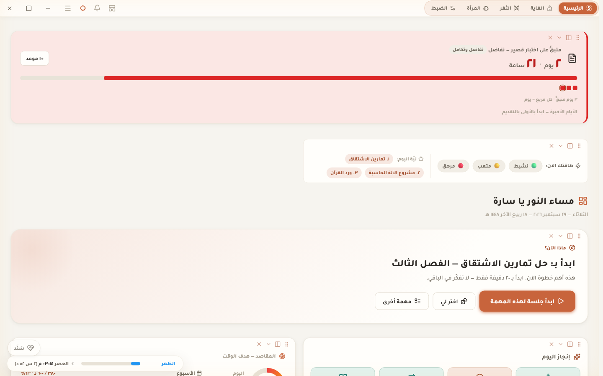
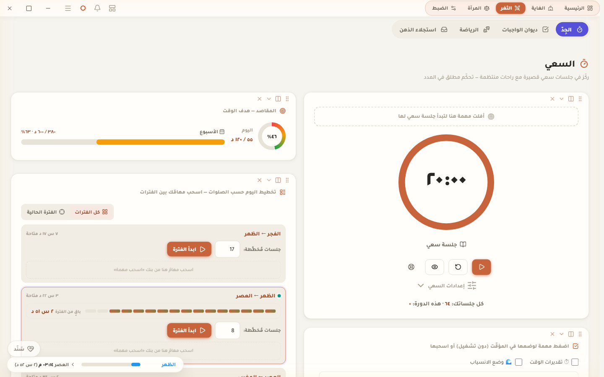
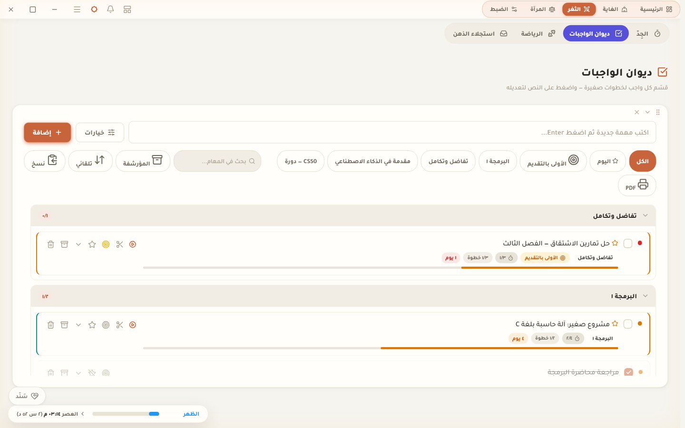
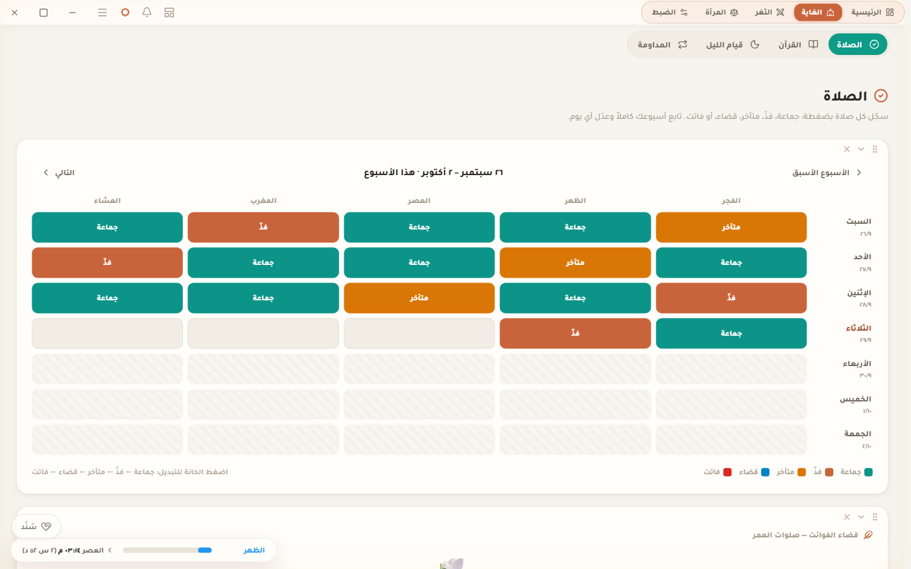
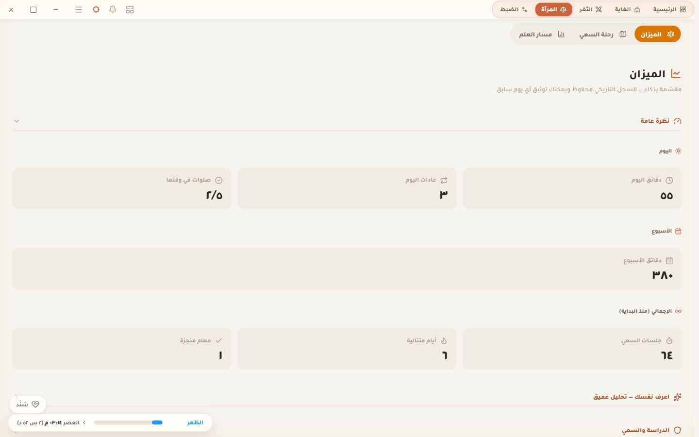
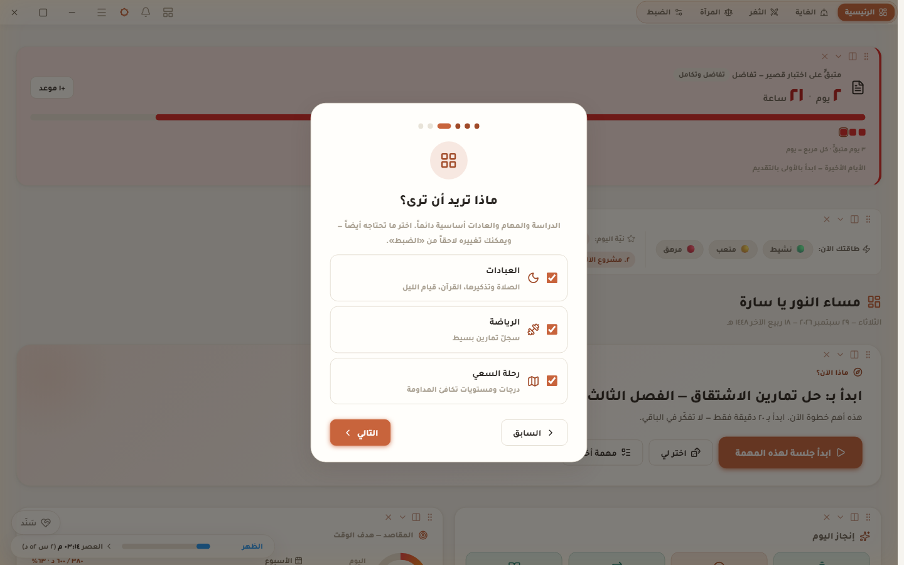
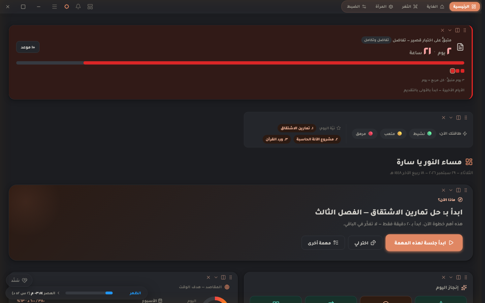

<div dir="rtl" align="center">

# مُستدرِك · Mustadrik

**رفيقٌ هادئ للدراسة والعبادة والعادات — على جهازك، دون حساب، ودون إنترنت.**

[](https://github.com/Nooh-Ibrahim/mustadrik/actions/workflows/ci.yml)
[](https://github.com/Nooh-Ibrahim/mustadrik/releases/latest)
[](LICENSE)


[**⬇️ تنزيل أحدث إصدار**](https://github.com/Nooh-Ibrahim/mustadrik/releases/latest) · [English](#english)



</div>

<div dir="rtl">

## لماذا مُستدرِك؟

صُمِّم لعقلٍ مشتّت قبل أي شيء آخر: خطوة واحدة واضحة بدل عشرين قائمة، وتشجيع لطيف بدل اللوم،
ووقتٌ تراه أمامك بدل أن يتسرّب. كل شيء اختياري ويُكشَف عند الطلب — والهدوء هو الوضع الافتراضي.

- **«ماذا الآن؟»** — زر واحد كبير يقترح المهمة التالية ويبدأ جلسة تركيز لها.
- **خصوصيتك كاملة** — بياناتك في ملف على جهازك فقط. لا حساب، لا خادم، لا تتبّع.
- **يعمل دون إنترنت** — الخطوط والأيقونات مضمّنة؛ الإنترنت يُستخدم فقط لجلب مواقيت الصلاة إن أدخلت مدينتك.
- **عربي أولاً** — واجهة من اليمين لليسار، أرقام عربية، وتقويم هجري.

## المزايا

| القسم | ماذا تجد فيه |
|---|---|
| ⏱️ **الجِدّ (مؤقّت التركيز)** | جلسات وراحات قابلة للضبط، «كتلة سعي» بمدة كلية، تقدير «ينتهي كل شيء الساعة X»، وضع الانسياب، أصوات خلفية، وويدجت عائم + أزرار في شريط المهام يعمل والتطبيق مصغّر. |
| ✅ **ديوان الواجبات** | خطوات صغيرة لكل واجب، مواعيد استحقاق وتكرار، «اليوم»، ترتيب يدوي بالسحب، بحث، أرشفة، وتصدير PDF. |
| 🎓 **المساقات والترم** | مقررات الجامعة والدورات الإلكترونية، وحدات تحسب التقدّم، مواعيد الامتحانات والتسليمات، جدول المحاضرات، والمعدّل التراكمي. |
| 🕌 **العبادات** | مواقيت الصلاة (٢٠ طريقة حساب رسمية) مع تذكير قبل الأذان، سجل الصلوات (جماعة/فذّ/متأخر/قضاء)، مخطّط **قضاء الفوائت**، وِرد القرآن والختمة، وقيام الليل. |
| 🔁 **المداومة** | عادات وأذكار في مكان واحد، تقويم أسبوع/شهر/سنة، و«رحمة السلسلة» التي تغفر يوماً واحداً في الأسبوع. |
| ⚖️ **الميزان** | إحصاءات اليوم والأسبوع والإجمالي، أنشط أوقاتك، تقرير أسبوعي، و«رحلة السعي» بدرجات ومستويات. |
| 🛡️ **بياناتك آمنة** | نسخة احتياطية يومية تلقائية، لقطات يمكن الرجوع إليها، استيراد/تصدير، ومزامنة عبر مجلد (Google Drive / OneDrive) بين أجهزتك. |

مزايا خاصة تبقى **مخفية تماماً** حتى تفعّلها بنفسك: متتبّع الدواء، ورفيق العزيمة.

## لقطات

| | |
|:-:|:-:|
| <br>**الجِدّ — مؤقت التركيز وتخطيط اليوم بين الصلوات** | <br>**ديوان الواجبات — خطوات ومواعيد** |
| <br>**الصلاة — سجلٌّ أسبوعي بضغطة** | <br>**الميزان — إحصاءاتك** |
| <br>**أول تشغيل — جولة قصيرة، كل خطوة اختيارية** | <br>**الوضع الداكن** |

> اللقطات من ملف تجريبي بأسماء وأرقام مخترعة (`npm run screenshots`).

## التثبيت

1. من صفحة [**الإصدارات**](https://github.com/Nooh-Ibrahim/mustadrik/releases/latest) نزّل أحد الملفين:
   - `Mustadrik-Setup-<الإصدار>.exe` — **المُثبِّت** (موصى به): اختصار على سطح المكتب، ويُحدِّث نفسه تلقائياً.
   - `Mustadrik-Portable-<الإصدار>.exe` — **نسخة محمولة** تعمل بنقرة دون تثبيت (لا تُحدِّث نفسها).
2. لأن البرنامج غير موقَّع رقمياً بعد، قد يظهر تحذير Windows SmartScreen:
   اضغط **«مزيد من المعلومات» ← «تشغيل على أي حال»**.
3. عند أول تشغيل تظهر جولة قصيرة: اسمك (اختياري)، لونك، ما تريد أن تراه، ومدينتك للمواقيت.

**التحديث من إصدار سابق:** ثبّت الإصدار الجديد فوق القديم مباشرة — بياناتك تبقى كما هي.

## اختصارات لوحة المفاتيح

| الاختصار | الوظيفة |
|---|---|
| <kbd>Ctrl</kbd>+<kbd>K</kbd> | لوحة الأوامر والبحث الشامل |
| <kbd>Space</kbd> | تشغيل / إيقاف جلسة التركيز |
| <kbd>F</kbd> | وضع التركيز |
| <kbd>N</kbd> | واجب جديد |
| <kbd>1</kbd>–<kbd>9</kbd> | التنقّل بين الصفحات |
| <kbd>Shift</kbd>+<kbd>?</kbd> | قائمة الاختصارات |
| <kbd>Ctrl</kbd>+<kbd>Alt</kbd>+<kbd>N</kbd> | التقاط فكرة سريعة من أي مكان في ويندوز |

## الخصوصية

لا يرسل مُستدرِك أي شيء عنك. الطلبات الوحيدة عبر الشبكة: جلب مواقيت الصلاة من `api.aladhan.com`
(إن أدخلت مدينتك)، وسؤال GitHub عن وجود إصدار أحدث (في النسخة المثبّتة فقط). التفاصيل في [SECURITY.md](SECURITY.md).

## للمطوّرين

```bash
git clone https://github.com/Nooh-Ibrahim/mustadrik.git
cd mustadrik
npm install
npm start          # تشغيل من المصدر
npm run lint       # فحص الشيفرة
npm test           # الاختبارات
npm run dist       # بناء ملفات exe في مجلد dist
```

البنية وقواعد البيانات وكيفية المساهمة في [CONTRIBUTING.md](CONTRIBUTING.md)، وسجل التغييرات في [CHANGELOG.md](CHANGELOG.md).

## المؤلف

صُنع بعناية على يد **نـوح إبراهيم** —
[GitHub](https://github.com/Nooh-Ibrahim) ·
[LinkedIn](https://www.linkedin.com/in/%D9%86%D9%80%D9%88%D8%AD-%D8%A5%D8%A8%D8%B1%D8%A7%D9%87%D9%8A%D9%85-49253b434/) ·
[Instagram](https://www.instagram.com/nooh.m.ibrahim/) ·
[Facebook](https://www.facebook.com/share/1Be38zyQJD/?mibextid=wwXIfr)

وجدت خطأً أو لديك فكرة؟ [افتح Issue](https://github.com/Nooh-Ibrahim/mustadrik/issues/new) — كل ملاحظة تُقرأ.

الترخيص: [MIT](LICENSE) · الخطوط والأيقونات المضمّنة: [THIRD_PARTY_NOTICES.md](THIRD_PARTY_NOTICES.md)

</div>

---

<a id="english"></a>

## English

**Mustadrik** (Arabic: *the one who makes up for lost time*) is a calm, offline-first Windows app for
students who want to study, pray and build habits without drowning in lists. It is designed ADHD-first:
one clear next action, gentle encouragement instead of guilt, and time you can *see*.
The interface is in Arabic (right-to-left).

### Highlights

- **“What now?”** — one big button suggests your next task and starts a focus session for it.
- **Focus timer** with sessions/breaks, a total-time “block”, “you'll finish at HH:MM” estimates, flow mode,
  ambient sounds, a floating mini-timer and taskbar buttons.
- **Tasks** with small steps, due dates, repeats, “today”, drag-to-reorder, search, archive, PDF export.
- **Courses & term** — university courses and online courses, unit-based progress, exam/assignment deadlines,
  weekly lecture schedule and GPA.
- **Worship** — prayer times (20 official calculation methods, via api.aladhan.com) with reminders,
  a weekly prayer log, a lifetime *qada* planner, Quran reading and night prayer tracking.
- **Habits & adhkar** with week/month/year calendars and a forgiving streak.
- **Stats** — today/week/all-time, your most productive hours, a weekly review, and levels.
- **Your data stays yours** — stored locally only, daily automatic backups, restorable snapshots,
  import/export, and optional sync through any cloud-synced folder. No account, no server, no telemetry.

### Install

Download the latest release from **[Releases](https://github.com/Nooh-Ibrahim/mustadrik/releases/latest)**:
`Mustadrik-Setup-<version>.exe` (installer, auto-updates) or `Mustadrik-Portable-<version>.exe` (no install).
The app is not code-signed yet, so Windows SmartScreen may warn you: choose **More info → Run anyway**.
Upgrading: install the new version over the old one — your data is kept.

### Build from source

```bash
git clone https://github.com/Nooh-Ibrahim/mustadrik.git && cd mustadrik
npm install
npm start        # run
npm run lint && npm test
npm run dist     # Windows installer + portable exe in dist/
```

See [CONTRIBUTING.md](CONTRIBUTING.md) for the architecture and the data-compatibility rules,
[SECURITY.md](SECURITY.md) for privacy details, and [CHANGELOG.md](CHANGELOG.md) for release notes.

### License

[MIT](LICENSE) © 2026 Nooh Ibrahim. Bundled fonts (Tajawal, Amiri — OFL) and icons (Lucide — ISC) keep
their own licenses; see [THIRD_PARTY_NOTICES.md](THIRD_PARTY_NOTICES.md).
